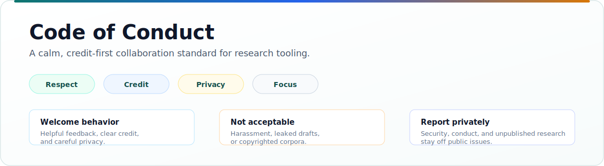

  

<h1 align="center">Code of Conduct</h1>

  <b>Respectful, credit-first collaboration for research-paper tooling.</b> 
  Keep discussion useful, public-safe, and focused on improving the package.

  
    <a href="CONTRIBUTING.md">Contributing</a> ·
    <a href="SECURITY.md">Security</a> ·
    <a href="README.md">README</a>
  

---

## Our Standard

This project is for researchers, students, maintainers, and builders working
on publication workflows. We expect careful, generous collaboration because
research tooling often touches drafts, reviews, citations, and unpublished
work.

| Welcome | Not Acceptable |
|---|---|
| Kind, specific feedback | Harassment, insults, threats, or discrimination |
| Good-faith disagreement | Repeated derailing after maintainers ask to refocus |
| Clear attribution and credit | Presenting others' work as your own |
| Respect for private research material | Posting drafts, reviews, credentials, or unpublished artifacts without permission |
| Copyright-aware examples | Uploading paper PDFs, copied abstracts, benchmark corpora, generated caches, or other content that should not be redistributed |

## Collaboration Norms

- Critique ideas, code, documentation, and process rather than people.
- Assume contributors may come from different fields, institutions, time zones,
  languages, and experience levels.
- Ask clarifying questions before escalating disagreement.
- Keep examples public-safe and minimal.
- Credit prior work, maintainers, and contributors clearly.
- Protect confidential reviews, manuscripts, datasets, credentials, and local
  workspaces.

## Scope

This code applies in project spaces, including issues, pull requests,
discussions, reviews, and project-related communication.

It also applies when project work crosses into research material. Do not use
this repository to expose someone else's private draft, review, dataset,
credentials, or unpublished result.

## Reporting

Report conduct concerns privately through GitHub. Do not post sensitive
personal, security, or unpublished research details in public issues.

When reporting, include:

- What happened.
- Where it happened.
- Who was involved.
- Any links or screenshots that are safe to share privately.

## Enforcement

Maintainers may edit, hide, or remove comments; close issues or pull requests;
or block participation when behavior harms the project or its contributors.
Enforcement should be proportionate, documented when appropriate, and focused
on keeping the project safe and useful.
