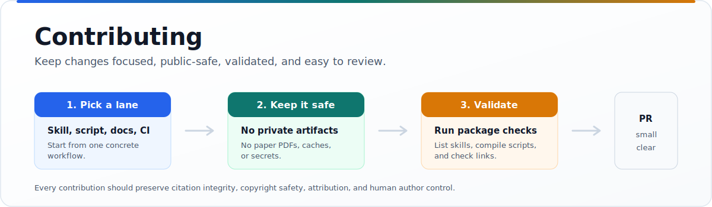

<p align="center">
  
</p>

<h1 align="center">Contributing</h1>

<p align="center">
  <b>Improve the public skill package with focused, validated, copyright-safe changes.</b><br>
  Skills, scripts, docs, and workflows are welcome when they can ship cleanly.
</p>

<p align="center">
  <sub>
    <a href="CODE_OF_CONDUCT.md">Code of Conduct</a> ·
    <a href="SECURITY.md">Security</a> ·
    <a href=".github/pull_request_template.md">Pull Request Template</a>
  </sub>
</p>

---

## Contribution Lanes

| Lane | Good examples | Keep out |
|---|---|---|
| Skills | New or improved `skills/<skill-name>/SKILL.md` files | Private evals, unpublished methods, venue dumps |
| Scripts | Small deterministic helpers under `skills/<skill-name>/scripts/` | Secrets, generated caches, heavyweight private tooling |
| References | Public guidance under `skills/<skill-name>/references/` | Copied paper text, abstracts, publisher content |
| Docs | README, install, integration, attribution, examples | Claims that depend on unreleased private evidence |
| Workflows | Self-contained validation for this public package | CI that depends on private tools, venues, fixtures, or templates |

## Public-Safe Rule

Before adding anything, ask whether the file can be released to the world as
source code or documentation.

Do not contribute:

- Paper PDFs, copied abstracts, publisher text, or copyrighted corpora.
- Private reviews, unpublished manuscripts, private evals, benchmark fixtures,
  findings, generated caches, venue/profile dumps, or local workspace output.
- Tooling that depends on unreleased private directories.
- Secrets, tokens, account names, private Overleaf links, or credentials.

## Skill Guidelines

Each skill should be a normal Agent Skills folder:

```text
skills/<skill-name>/
  SKILL.md
  references/        optional public guidance
  scripts/           optional deterministic helpers
```

`SKILL.md` should:

- Start with valid YAML frontmatter.
- Use a lowercase-hyphen `name` that matches the directory.
- Include a clear third-person `description` explaining what the skill does
  and when an agent should use it.
- State guardrails, especially around citation integrity, copyright, venue
  rules, and human approval.
- Link only to files included in the public package.

Scripts should:

- Prefer Python standard library unless there is a strong reason otherwise.
- Be deterministic where possible and exit nonzero on failed checks.
- Avoid bulk-downloading paper content.
- Rate-limit network calls, back off on HTTP 429, and identify the caller when
  contacting public scholarly APIs.

## Local Checks

Run the lightweight checks before opening a pull request:

```bash
python3 -m py_compile $(find skills -path '*/scripts/*.py')
npx skills add . --list
```

If you changed `README.md`, make sure every relative link points to a file that
exists in this repository.

If you changed workflow or issue-template YAML, parse it locally:

```bash
ruby -e 'require "yaml"; ARGV.each { |f| YAML.load_file(f); puts "OK #{f}" }' .github/**/*.yml
```

## Pull Request Shape

A good pull request is small enough to review in one sitting.

| Include | Why it helps |
|---|---|
| Summary of the change | Maintainers can understand scope quickly. |
| Affected skill or file list | Reviewers can route to the right context. |
| Validation output | The package stays installable. |
| Public-safety note | Confirms no private or copyrighted artifacts slipped in. |
| Attribution note, when relevant | Credit and license obligations stay clear. |

By contributing, you agree that your contribution is submitted under the
project's Apache-2.0 license.
