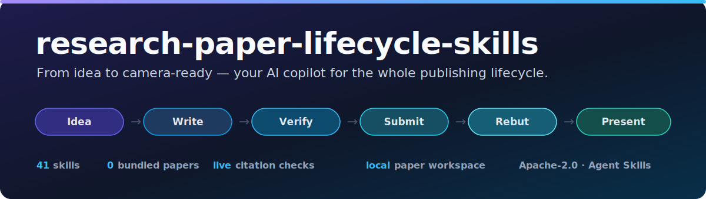
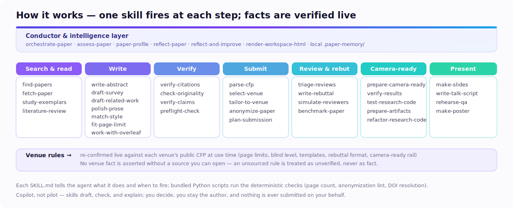

<p align="center">
  
</p>

<h1 align="center">research-paper-lifecycle-skills</h1>

<p align="center">
  <b>Agent skills for the whole research-paper lifecycle: discover, write,
  verify, submit, rebut, publish, and present with rules checked from live
  sources.</b><br>
  Field-agnostic, citation-aware, and designed as a copilot: you stay the
  author, the agent does the careful checking.
</p>

<p align="center">
  <a href="LICENSE"></a>
  <a href="#find-the-skill-you-need"></a>
  <a href="#what-it-wont-do"></a>
  <a href="#how-it-works"></a>
  <a href="https://agentskills.io"></a>
  <a href="https://shaishavmaisuria.github.io/research-paper-lifecycle-skills/"></a>
</p>

<p align="center">
  <sub>
    <a href="#quick-start-60-seconds">Quick start</a> ·
    <a href="#how-it-works">How it works</a> ·
    <a href="#find-the-skill-you-need">All 42 skills</a> ·
    <a href="#common-workflows">Workflows</a> ·
    <a href="#integrations">Integrations</a> ·
    <a href="https://shaishavmaisuria.github.io/research-paper-lifecycle-skills/">Website</a> ·
    <a href="#what-it-wont-do">Boundaries</a>
  </sub>
</p>

---

## Why this exists

Most AI writing tools stop at the draft. Papers get rejected after that: a page
over the limit, an author name left in a double-blind PDF, a missing checklist,
a hallucinated citation, a broken artifact, or a camera-ready step nobody had
time to read.

`research-paper-lifecycle-skills` gives compatible agents a structured
playbook for the research work around the paper. It can search and verify
sources, tighten writing without changing claims, check venue rules against
live CFPs or author instructions, triage reviews, prepare artifacts, and turn a
finished paper into slides, scripts, Q&A practice, or a poster.

Project website: <https://shaishavmaisuria.github.io/research-paper-lifecycle-skills/>

**Who it is for:** researchers, PhD students, labs, reviewers, and builders
supporting publication workflows in any discipline with public venue guidance.
The examples are academic-paper shaped, but the checks are intentionally
general: sourced rules, verified citations, local outputs, and human sign-off.

## Quick start (60 seconds)

```bash
# Any Agent Skills-compatible environment
npx skills add ShaishavMaisuria/research-paper-lifecycle-skills
```

```bash
# See what is included
npx skills add ShaishavMaisuria/research-paper-lifecycle-skills --list
```

```bash
# Install one skill
npx skills add ShaishavMaisuria/research-paper-lifecycle-skills --skill preflight-check
```

```bash
# Install into a supported agent target
npx skills add ShaishavMaisuria/research-paper-lifecycle-skills --agent codex
npx skills add ShaishavMaisuria/research-paper-lifecycle-skills --agent cursor
npx skills add ShaishavMaisuria/research-paper-lifecycle-skills --agent gemini
npx skills add ShaishavMaisuria/research-paper-lifecycle-skills --agent claude-code
```

Claude Code plugin marketplace:

```text
/plugin marketplace add ShaishavMaisuria/research-paper-lifecycle-skills
/plugin install paper-submission@research-paper-lifecycle-skills
```

Then ask in plain language:

```text
Will this get desk-rejected at an IEEE conference? Check my main.tex against this CFP.
```

The right skill should trigger itself, load its `SKILL.md`, run any relevant
helpers, and return a sourced report.

### No paper yet? Start with any paper folder

You do not need a bundled template. Put your draft files in a normal project
folder and let the skills build the research workflow around it.

1. **Create the basics:** `main.tex` or a manuscript draft, plus `refs.bib` if
   you already have references.
2. **Set the context:** ask for `paper-profile`, then say the target venue,
   field, contribution type, and deadline if you know them.
3. **Run the first checks:** ask *"verify refs.bib"*, *"find missing related
   work"*, *"write the abstract for SIGSPATIAL"*, or *"preflight my paper"*.

## How it works

<p align="center">
  
</p>

1. **Skills:** one folder per task. Each `SKILL.md` tells the agent when to
   use it, what to do, what to verify, and what not to touch.
2. **Live rules:** venue-aware skills build or re-check requirements from the
   live CFP, author instructions, or public policy page. Unsourced facts stay
   marked as unverified.
3. **Deterministic helpers:** bundled scripts handle repeatable checks such as
   citation resolution, anonymization linting, page-budget maps, timeline math,
   and dashboard rendering.
4. **Local workspace:** generated reports go into `paper-workspace/`; paper
   preferences and lessons can live in `.paper-memory/`. Both stay with the
   user's paper, not in this package.

## Find the skill you need

Open the linked `SKILL.md` for trigger rules, process, guardrails, references,
and bundled scripts. The complete public package currently contains 42 skills.

**Start here**

| I want to... | Skill |
|---|---|
| Run the whole lifecycle with checkpoints | [`orchestrate-paper`](skills/orchestrate-paper/SKILL.md) |
| Get one overall paper-health report | [`assess-paper`](skills/assess-paper/SKILL.md) |
| Capture paper positioning and preferences | [`paper-profile`](skills/paper-profile/SKILL.md) |
| Run Researcher and Writer reflection passes | [`reflect-paper`](skills/reflect-paper/SKILL.md) |
| Check whether a generated change actually improved | [`reflect-and-improve`](skills/reflect-and-improve/SKILL.md) |
| Render a browser dashboard of outputs | [`render-workspace-html`](skills/render-workspace-html/SKILL.md) |

**Complete linked index**

| Stage | Skill | Use it for |
|---|---|---|
| Discover | [`find-papers`](skills/find-papers/SKILL.md) | Search scholarly metadata and proceedings. |
| Discover | [`fetch-paper`](skills/fetch-paper/SKILL.md) | Fetch legal open-access copies. |
| Discover | [`study-exemplars`](skills/study-exemplars/SKILL.md) | Study strong papers from a target venue. |
| Discover | [`literature-review`](skills/literature-review/SKILL.md) | Build a structured, citation-grounded review. |
| Write | [`draft-survey`](skills/draft-survey/SKILL.md) | Produce a ranked reading list and standalone survey draft. |
| Write | [`write-abstract`](skills/write-abstract/SKILL.md) | Draft, revise, or lint a venue-aware abstract. |
| Write | [`draft-related-work`](skills/draft-related-work/SKILL.md) | Position related work against verified references. |
| Write | [`polish-prose`](skills/polish-prose/SKILL.md) | Tighten academic prose without changing claims. |
| Write | [`match-style`](skills/match-style/SKILL.md) | Align a draft to the author's voice or venue style. |
| Write | [`polish-tables-figures`](skills/polish-tables-figures/SKILL.md) | Clean up figures, tables, captions, and crossrefs. |
| Write | [`refactor-structure`](skills/refactor-structure/SKILL.md) | Repair argument structure and narrative flow. |
| Write | [`fit-page-limit`](skills/fit-page-limit/SKILL.md) | Compress or expand a paper to fit a target length. |
| Write | [`work-with-overleaf`](skills/work-with-overleaf/SKILL.md) | Bring Overleaf projects into a local workflow. |
| Verify | [`verify-citations`](skills/verify-citations/SKILL.md) | Check BibTeX entries for fabricated or mismatched records. |
| Verify | [`check-originality`](skills/check-originality/SKILL.md) | Check plagiarism, self-plagiarism, and text recycling. |
| Verify | [`verify-claims`](skills/verify-claims/SKILL.md) | Audit claims against evidence, results, and citations. |
| Submit | [`parse-cfp`](skills/parse-cfp/SKILL.md) | Turn a live CFP into a requirements card. |
| Submit | [`add-venue-profile`](skills/add-venue-profile/SKILL.md) | Create or refresh a venue profile from live sources. |
| Submit | [`select-venue`](skills/select-venue/SKILL.md) | Build a ranked venue and track shortlist. |
| Submit | [`tailor-to-venue`](skills/tailor-to-venue/SKILL.md) | Adapt a draft to a venue, track, template, or limit. |
| Submit | [`preflight-check`](skills/preflight-check/SKILL.md) | Catch desk-reject risks before submission. |
| Submit | [`anonymize-paper`](skills/anonymize-paper/SKILL.md) | Sweep for double-blind identity leaks. |
| Submit | [`plan-submission`](skills/plan-submission/SKILL.md) | Build a deadline-aware submission timeline. |
| Submit | [`simulate-reviewers`](skills/simulate-reviewers/SKILL.md) | Run a venue-calibrated mock review. |
| Submit | [`benchmark-paper`](skills/benchmark-paper/SKILL.md) | Compare draft shape to strong venue exemplars. |
| Respond | [`triage-reviews`](skills/triage-reviews/SKILL.md) | Convert raw reviews into a response plan. |
| Respond | [`write-rebuttal`](skills/write-rebuttal/SKILL.md) | Draft rebuttals and author responses. |
| Publish | [`prepare-camera-ready`](skills/prepare-camera-ready/SKILL.md) | Walk through final-file and publication rails. |
| Artifacts | [`test-research-code`](skills/test-research-code/SKILL.md) | Make research code runnable and repeatable. |
| Artifacts | [`verify-results`](skills/verify-results/SKILL.md) | Compare reported metrics with local outputs. |
| Artifacts | [`refactor-research-code`](skills/refactor-research-code/SKILL.md) | Clean research code for release without changing behavior. |
| Artifacts | [`prepare-artifacts`](skills/prepare-artifacts/SKILL.md) | Package code/data for reproducibility review. |
| Present | [`make-slides`](skills/make-slides/SKILL.md) | Turn a paper into a conference talk deck. |
| Present | [`write-talk-script`](skills/write-talk-script/SKILL.md) | Write a timed speaker script. |
| Present | [`rehearse-qa`](skills/rehearse-qa/SKILL.md) | Practice hostile and curious Q&A. |
| Present | [`make-poster`](skills/make-poster/SKILL.md) | Create and check a research poster. |

## Common workflows

```text
New paper:        paper-profile -> literature-review -> write-abstract -> draft-related-work -> polish-prose
Survey draft:     find-papers -> draft-survey -> verify-citations -> polish-prose
Before submit:    parse-cfp -> tailor-to-venue -> anonymize-paper -> preflight-check
Quality pass:     verify-citations -> check-originality -> benchmark-paper -> simulate-reviewers -> assess-paper
Reflection:       reflect-paper -> polish-prose / verify-claims -> reflect-and-improve
Length pass:      fit-page-limit -> polish-prose / refactor-structure / polish-tables-figures
Overleaf:         work-with-overleaf -> preflight-check / verify-citations / polish-prose -> work-with-overleaf
Artifacts:        test-research-code -> verify-results -> refactor-research-code -> prepare-artifacts
Reviews are in:   triage-reviews -> write-rebuttal
Accepted:         prepare-camera-ready -> make-slides -> write-talk-script -> rehearse-qa -> make-poster
End to end:       orchestrate-paper
```

## Usage examples

| You ask | You get |
|---|---|
| *"Will this get desk-rejected at an IEEE conference? Check my `main.tex` against this CFP."* | A preflight report with template, page-limit, anonymization, checklist, and policy risks tied to live requirements. |
| *"Verify `refs.bib` and flag fabricated or mismatched citations."* | Entries checked against scholarly metadata sources, with wrong years, duplicates, suspicious records, and unresolved references surfaced. |
| *"Write a ranked reading list and two-column arXiv survey draft on geospatial data conflation."* | A verified reading list, taxonomy, original-prose survey draft, and clean bibliography grounded in real resolved papers. |
| *"Humanize this section, but do not change any claims."* | Cleaner academic prose with AI-tell phrasing removed while numbers, results, and citations stay fixed. |
| *"I am one page over the limit; what should I cut?"* | A section-budget map plus a ranked compression plan that preserves the paper's core evidence. |
| *"Turn these reviews into a rebuttal plan with severity and effort."* | A point-by-point matrix, prioritized response strategy, and handoff to the rebuttal skill. |
| *"Show me an HTML dashboard of my progress."* | A local `paper-workspace/dashboard.html` with stage progress, artifact links, and recent activity. |

**Worked example: idea to a clean SIGSPATIAL submission**

```text
I have a method and results for streaming-trajectory indexing.
Get it submission-ready for SIGSPATIAL.
```

1. `paper-profile` records contribution type, target audience, constraints,
   and risk appetite.
2. `find-papers`, `literature-review`, and `verify-citations` build a verified
   reference base.
3. `write-abstract`, `draft-related-work`, `polish-prose`, and `match-style`
   shape the draft without changing claims.
4. `parse-cfp`, `tailor-to-venue`, `anonymize-paper`, and `preflight-check`
   verify live requirements and desk-reject risks.
5. `fit-page-limit`, `simulate-reviewers`, `benchmark-paper`, and
   `assess-paper` produce the review-readiness pass.
6. `render-workspace-html` gives a local dashboard of the resulting
   `paper-workspace/` outputs.

## Integrations

This is an Agent Skills package, not a single-agent prompt bundle. The
repository ships portable `SKILL.md` folders plus optional scripts and
references, so any agent that understands the Agent Skills format can use it.

| Environment | Install |
|---|---|
| Codex | `npx skills add ShaishavMaisuria/research-paper-lifecycle-skills --agent codex` |
| Cursor | `npx skills add ShaishavMaisuria/research-paper-lifecycle-skills --agent cursor` |
| Gemini CLI | `npx skills add ShaishavMaisuria/research-paper-lifecycle-skills --agent gemini` |
| Claude Code | `npx skills add ShaishavMaisuria/research-paper-lifecycle-skills --agent claude-code` or `/plugin install ...` |
| Any compatible agent | `npx skills add ShaishavMaisuria/research-paper-lifecycle-skills` |

Optional Claude Code plugin bundles currently exposed in
`.claude-plugin/marketplace.json`: `paper-search`, `paper-writing`,
`paper-submission`, and `paper-presenting`. Use the Agent Skills CLI above to
install the complete 42-skill package.

Manual install for tools with their own skills directory:

```bash
mkdir -p "$YOUR_AGENT_SKILLS_DIR"
SKILL_NAME=preflight-check
cp -R "skills/$SKILL_NAME" "$YOUR_AGENT_SKILLS_DIR/"
```

## Memory and dashboards

Most tools forget you when the chat ends. This package uses a local
`.paper-memory/` convention, described in
[`paper-memory-convention.md`](skills/paper-profile/references/paper-memory-convention.md),
so skills can reuse paper positioning, writing preferences, decisions, and
lessons without uploading them.

`reflect-paper` can run paired Researcher and Writer reflection passes: one
checks evidence, novelty, positioning, and venue fit; the other checks story,
structure, tone, and reader friction. `reflect-and-improve` then asks whether a
change measurably helped before accepting it.

`render-workspace-html` turns `paper-workspace/` into a local browser dashboard
with progress, artifact cards, and recent activity. The dashboard is
self-contained HTML, refreshable on request, and never uploaded by the skill.

## What it won't do

- **No acceptance predictions.** Scores measure conformance, completeness, and
  quality signals; they do not predict reviewer decisions.
- **No automatic submission.** Skills can prepare, check, and explain, but they
  do not upload or submit a paper for you.
- **No invented citations or venue facts.** Unresolved citations and unsourced
  rules are marked as risks instead of being smoothed over.
- **No bundled paper content.** Paper PDFs and copyrighted corpora are not
  redistributed in this repository.
- **No authorship laundering.** The skills can polish language and surface
  issues, but you remain responsible for the work and final text.

## Principles

1. **Human-led.** Skills draft, check, and explain; the author decides.
2. **Citation-aware.** Writing workflows route new references through
   verification instead of trusting plausible text.
3. **Copyright-conscious.** Paper content is fetched only from legal open
   sources, on demand, and is not bundled in this repository.
4. **Venue-skeptical.** Profiles and CFP facts can go stale; final rules must
   be checked live, with source links, before relying on them.
5. **Portable.** The repository ships skills, scripts, README visuals, and
   package metadata; not paper PDFs or cached research corpora.

## Make it yours

The lifecycle is field-agnostic. To adapt it for another discipline, copy a
skill folder, adjust its `SKILL.md` triggers and guardrails, and keep the same
verification-first habit: sourced venue rules, verified citations, and local
outputs only.

## Repository layout

```text
assets/                         README and community visuals
docs/                           GitHub Pages landing page and crawl files
skills/                         42 agent skills
  <skill>/SKILL.md               instructions and guardrails
  <skill>/references/            supporting guidance
  <skill>/scripts/               deterministic helper scripts
.claude-plugin/marketplace.json  optional Claude Code plugin bundle metadata
.github/ISSUE_TEMPLATE/          issue forms for bugs, docs, and skill requests
.github/workflows/              public package validation workflow
CODE_OF_CONDUCT.md               community behavior expectations
CONTRIBUTING.md                  contribution guide
SECURITY.md                      vulnerability reporting policy
LICENSE                          Apache-2.0 license
NOTICE                           attribution notice
CITATION.cff                     citation metadata
```

## Attribution and license

Copyright 2026 Shaishav Maisuria.

Licensed under the Apache License, Version 2.0. See [LICENSE](LICENSE).

If you redistribute this package or include substantial portions of these
skills in another repository, keep the copyright/license notices and the
[NOTICE](NOTICE) attribution file so the original work is credited.

*Disclaimer: venue rules change every year. Always confirm against the live CFP
or author instructions before submission.*
