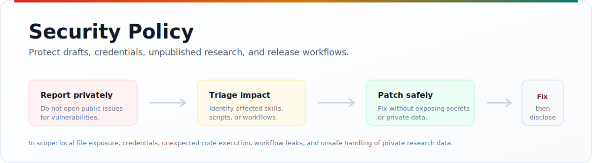

  

<h1 align="center">Security Policy</h1>

  <b>Report vulnerabilities privately and protect drafts, credentials, unpublished research, and release workflows.</b>

  
    <a href="CODE_OF_CONDUCT.md">Code of Conduct</a> ·
    <a href="CONTRIBUTING.md">Contributing</a> ·
    <a href="README.md">README</a>
  

---

## Supported Versions

Security fixes apply to the current `main` branch of this repository.

## Report Privately

Please do not open a public issue for security reports.

Use GitHub private vulnerability reporting if it is enabled for the repository.
If it is not available, contact the maintainer privately through GitHub before
sharing sensitive details.

Useful reports include:

| Include | Notes |
|---|---|
| Short description | What can go wrong and who is affected. |
| Steps to reproduce | Use minimal public-safe examples. |
| Affected files | Skills, scripts, workflows, package metadata, or docs. |
| Logs or proof of concept | Remove secrets, private drafts, and credentials. |
| Suggested mitigation | Optional, but helpful. |

## Scope

In scope:

- Scripts that could expose local files, credentials, drafts, or unpublished
  research material.
- Workflows that could leak repository secrets or publish unintended artifacts.
- Install or packaging behavior that could execute unexpected code.
- Prompt or skill behavior that could encourage unsafe handling of private
  research data.
- Citation, fetch, or workspace helpers that write data outside the expected
  local project area.

Out of scope:

- Reports about third-party scholarly APIs unless the issue is caused by this
  package's code.
- Social engineering, spam, denial-of-service, or scanner-only reports without
  a concrete impact.
- Claims that require redistributing copyrighted paper content to reproduce.

## Handling Expectations

The maintainer will acknowledge valid reports when possible, investigate the
impact, and publish a fix or mitigation before encouraging public disclosure.

Please give the maintainer time to patch before sharing details publicly.
